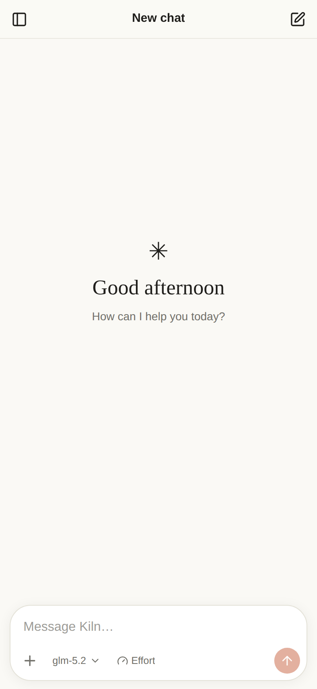
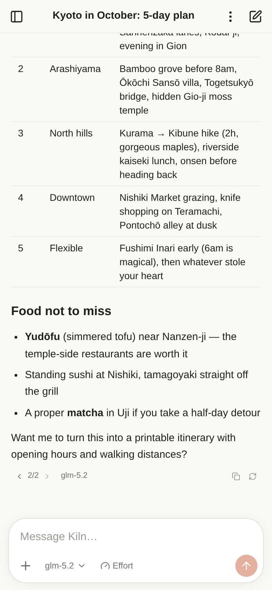
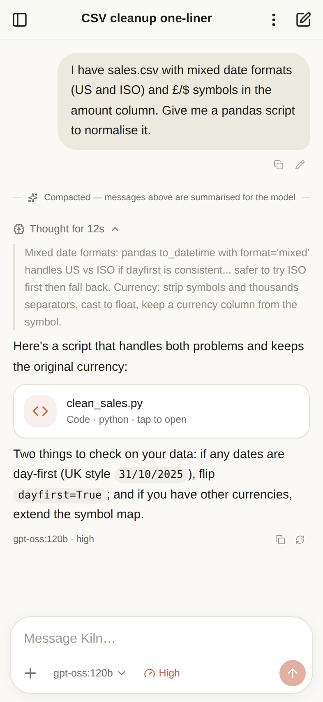
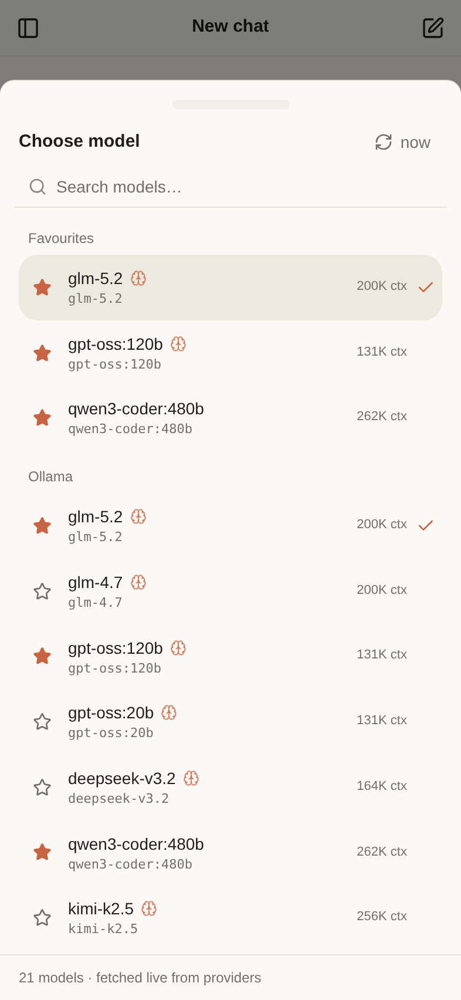
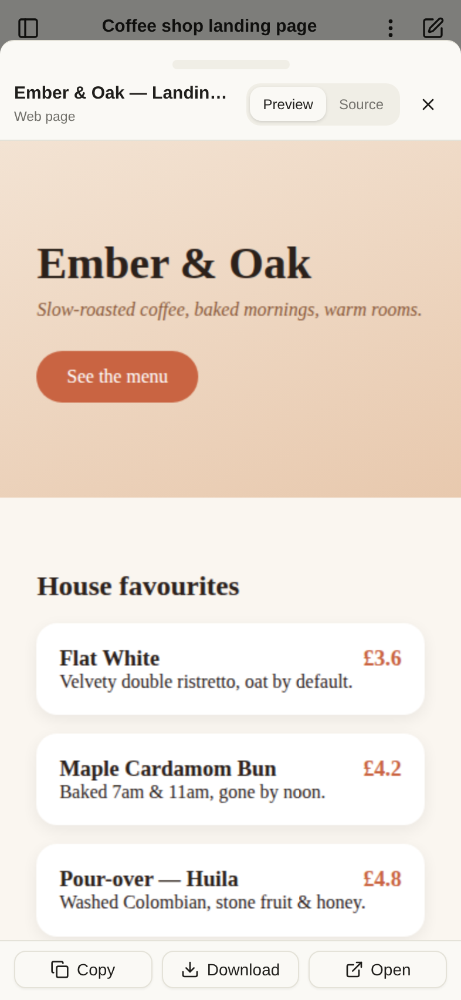
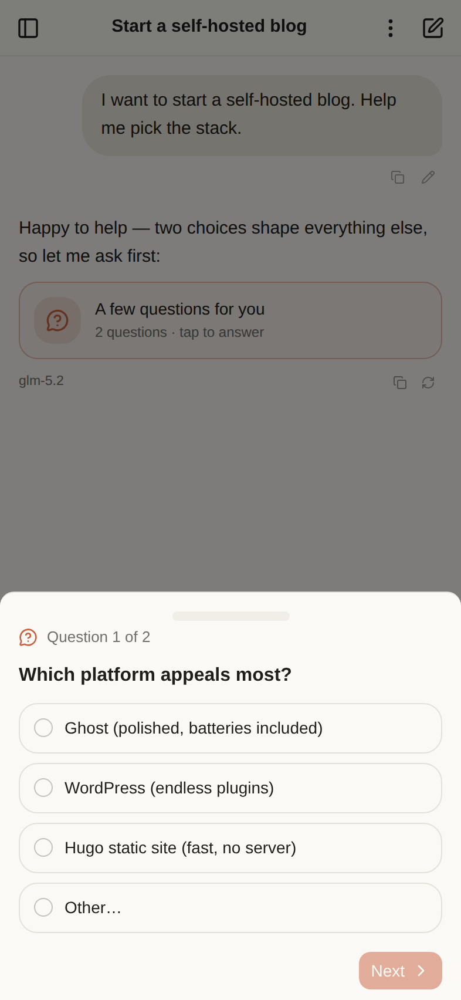
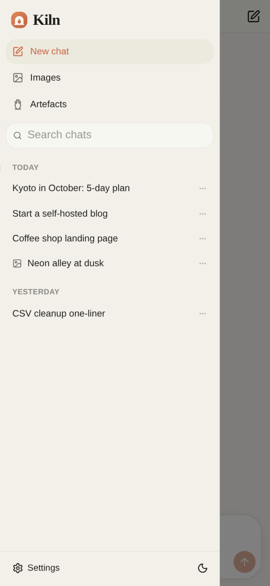
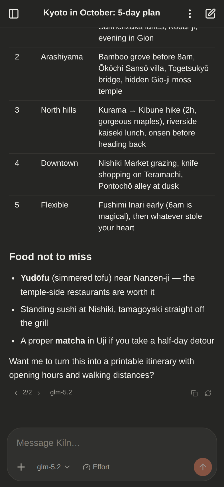

# Kiln — a local-first mobile AI chat PWA

Kiln is a mobile-first AI chat app you install from your own server as a PWA
— no App Store required. It talks **directly from your phone to the model
providers** (OpenRouter, Ollama cloud) with your own API keys, and stores
**everything on the device** (IndexedDB). The server's only jobs are to hand
out the static files and to relay Ollama traffic; your chats and keys never
touch it.

Built with React 19, Vite 8, Tailwind CSS 4, shadcn/ui, Dexie and Workbox.

## Screenshots

Shown with Ollama cloud models (GLM-5.2, gpt-oss and friends). Seeded demo
data — regenerate any time with `npm run shots`.

| New chat | Chat | Reasoning | Model picker |
| :---: | :---: | :---: | :---: |
|  |  |  |  |

| Artefacts | Questions | Sidebar | Dark mode |
| :---: | :---: | :---: | :---: |
|  |  |  |  |

## Features

- **Chat & history** — streaming markdown chat with code highlighting, tables,
  chat list grouped by day, rename, delete, export/import (JSON), and
  **full-text search** across every message (with snippets).
- **Context management** — a chars-based token estimate of every request;
  when a chat nears the model's context limit it is **auto-compacted**
  (older messages summarised by your utility model, newer ones kept
  verbatim). Messages stay visible — a divider marks what's summarised.
  A meter pill appears at 60% usage for one-tap compaction.
- **Slash commands** — type `/` in the composer: `/compact [focus]`,
  `/clear` (fresh context, messages kept), `/title`, `/model`, `/effort`,
  `/export`, `/help`.
- **Message editing & versions** — edit any of your messages and resend
  (later messages are replaced after a confirm); regenerating a reply keeps
  every attempt with a Claude-style ‹ 1/2 › version switcher, including
  when you switch model between attempts.
- **Artefacts** — the assistant can emit Markdown documents, self-contained
  HTML pages, code files and SVGs as tappable cards with a full-screen
  viewer: rendered preview (sandboxed iframe for HTML/SVG), source view,
  copy / download / open. An **Artefacts** section in the sidebar collects
  every artefact across all chats — searchable, filterable by type, with a
  jump back to the source chat. (The wire tag stays `<artifact>` — US
  spelling is the convention models know.)
- **Interactive questions** — the assistant can end a reply with up to four
  multiple-choice questions (a `<questions>` block, like Claude's question
  chips). They pop up as a sheet with next/back and a review-then-submit
  step (a single question submits directly), always with a free-text
  option. Dismiss the sheet to read the chat and reopen it from the
  question card in the conversation; answers go back as a normal message.
- **Attachments** — capability-aware, driven by each model's provider
  metadata: photos (auto-downscaled) for vision models on **both**
  providers — Ollama takes base64 images natively per its vision API;
  text/code files (inlined) for any model; PDFs for OpenRouter models
  (Ollama's API has no document input). The picker only offers what the
  selected model accepts, and switching to an incompatible model warns
  before sending.
- **Providers** — OpenRouter and Ollama cloud, with live model fetching
  (only for providers whose key you've configured), per-provider grouping,
  search, context length, pricing, and capability badges (vision /
  reasoning / image output). API keys are stored in localStorage on the
  device and go only to the provider. Adding or changing a key refreshes
  the model list immediately.
- **Reasoning effort** — the effort menu shows exactly what each model
  supports, straight from provider metadata: OpenRouter's per-model
  `reasoning.supported_efforts` (e.g. max/xhigh/high/medium/low/none),
  on/off toggles for models where thinking is optional but has no levels,
  and Ollama `think` levels for gpt-oss (on/off for other thinking models).
  Thinking traces show in a collapsible "Thought for Ns" block.
- **Per-message model tracking** — switch model or effort mid-chat; every
  assistant message records the provider/model/effort that produced it.
  The last-used model is remembered for the next chat.
- **Chat titles** — generated by a second LLM call after the first reply;
  choose the title model in Settings (default: same model as the chat).
- **Temporary chats** — ghost mode: kept in memory only, never written to
  disk, with one tap "Save to history" if you change your mind.
- **Skills** — reusable instruction packs (create in Settings, toggle per
  chat from the ＋ menu). Skills marked "on by default" apply to new chats.
- **Personalisation** — name / role / preferences appended to the system
  prompt; the default system prompt is editable and resettable.
- **Built-in tools** — Tavily web search (bring your key) and web fetch
  (reads pages via the CORS-friendly r.jina.ai reader), used agentically by
  tool-capable models, with inline "Searched …" / "Read …" step chips.
- **Image generation** — a separate Images studio optimised for generating
  and browsing pictures with image-output models (e.g. Gemini Flash Image
  on OpenRouter), with full-screen viewing and download.
- **Model favourites** — star models in the picker to pin them to a
  Favourites group at the top.
- **PWA** — installable, offline app shell, light/dark (or follow system),
  safe-area aware, iOS keyboard-friendly. Requests **persistent storage**
  so the browser won't evict your chats, shows storage usage in Settings,
  prompts with an "Update" toast when a new version is deployed, and a
  crash screen (error boundary) protects against white-screens.
- **Notifications** — optional "reply finished" notification + app badge
  when the app is in the background.
- **Resilient streaming** — every chunk is persisted to IndexedDB as it
  arrives; if the OS kills the tab mid-answer you keep everything received
  so far, marked "interrupted", with a one-tap **Continue generating**.
  An optional wake lock keeps the screen on during long generations.
- **Server hand-off (optional)** — "Send to server" POSTs a chat as JSON to
  a URL you configure, ready for a future sync backend.

## Quick start (Docker)

```bash
docker compose up -d --build
# → http://your-server:8080
```

Or without compose:

```bash
docker build -t kiln .
docker run -d --name kiln -p 8080:8080 --restart unless-stopped kiln
```

### Prebuilt image (GHCR)

CI publishes `ghcr.io/itbm/kiln` on every push to `main`, tagged `latest`
and with the contents of `VERSION` (amd64 + arm64). Pull requests build the
image as a check but never push. `compose.prod.yaml` runs the prebuilt
image (with `pull_policy: always`, so `up -d` picks up new releases):

```bash
docker compose -f compose.prod.yaml up -d
```

Pin a version by editing its `image:` tag, e.g. `ghcr.io/itbm/kiln:0.2.0`.

Then on your phone, open the URL, and:

- **iOS** — Share → **Add to Home Screen**. (Run it over HTTPS — see below.)
- **Android** — Chrome menu → **Install app**.

Open **Settings** in the app and paste your OpenRouter and/or Ollama cloud
API keys (and a Tavily key if you want web search).

### HTTPS

iOS requires a secure context for service workers, notifications and
clipboard. Put Kiln behind your usual reverse proxy (Caddy, Traefik,
nginx-proxy-manager…) with a certificate. Plain `http://localhost` works for
desktop testing only.

### Container hardening & privacy

The compose file runs Kiln as an immutable, minimal-privilege container:

- **Read-only root filesystem** (`read_only: true`) — the only writable path
  is `/tmp`, an in-memory tmpfs holding nginx's pid and temp paths, wiped on
  stop. Nothing can be persisted inside the container, by anyone.
- **Non-root** (`nginx-unprivileged`, uid 101) with **all capabilities
  dropped** and `no-new-privileges`.
- **No access logs** — who chatted and when is never recorded (errors still
  go to stderr for `docker logs`).
- **The Ollama relay never spools chat data to disk** — request and response
  buffering to temp files is disabled in both directions — and it strips
  cookies both ways plus client-identifying headers, so the upstream sees
  only your API key, never a tracking cookie or the phone's address.

### The Ollama proxy

Ollama cloud doesn't send CORS headers, so browsers can't call it directly —
verified against both hosts (`ollama.com`, `api.ollama.com`) and both API
styles (native `/api/chat`, OpenAI-compatible `/v1/chat/completions`):
every preflight is rejected (405/301 with no `Access-Control-Allow-*`
headers), and authenticated requests always preflight because of the
`Authorization` header. The bundled nginx therefore forwards
`/api/ollama/*` → `https://ollama.com/*` (streaming enabled), and the app's
default Ollama endpoint is `/api/ollama`. Nothing to configure.

The relay is same-origin and path-based — no port is baked in anywhere. The
app calls it relative to whatever URL you're browsing on, so it works
identically on `http://host:8080`, behind a reverse proxy on 443, or any
other published port; nginx is configured to only ever emit relative
redirects so the container's internal port (8080) never leaks into
`Location` headers. You can
also point the endpoint at a LAN Ollama instance
(`http://192.168.x.x:11434`) if you export `OLLAMA_ORIGINS` there.
OpenRouter and Tavily are called directly from the device.

## Development

```bash
npm install
npm run dev          # dev server with the same /api/ollama proxy
npm run build        # type-check + production build into dist/
npm run preview      # serve the production build on :4173
npm run icons        # regenerate PNG icons from public/icons/icon.svg
npm run shots        # screenshot suite (needs `npm run preview` running)
```

Visit `http://localhost:5173/?seed=1` to load demo chats/models so you can
explore the UI without API keys.

## Server hand-off contract

> The Settings UI for this is currently hidden (`SHOW_SERVER_SECTION` in
> `SettingsPage.tsx`) because no backend exists yet — the plumbing below is
> implemented and ready for when one does.

"Send to server" POSTs to `{Server URL}/chats` with
`Authorization: Bearer {token}` (if set) and body:

```jsonc
{
  "app": "kiln",
  "version": 1,
  "exportedAt": 1730000000000,
  "chats": [ { "id": "…", "title": "…", … } ],
  "messages": [ { "id": "…", "chatId": "…", "role": "user", … } ]
}
```

Any small service that accepts that payload works; the same shape is used by
Export/Import, so a future backend can round-trip it.

## Honest limitations

- **Backgrounding on iOS**: Safari suspends network for backgrounded PWAs, so
  a stream can't keep running while you use another app. Kiln mitigates
  rather than pretends: partial output is saved continuously, the chat is
  marked *interrupted*, and **Continue generating** picks the answer back up.
  The optional wake-lock setting avoids the interruption entirely for long
  runs by keeping the screen on.
- **Notifications on iOS** require the app to be installed to the Home
  Screen (iOS 16.4+), and Apple only reliably shows service-worker
  notifications for pushes; on Android/desktop they work as expected.
- **PDF attachments** are supported on OpenRouter models only — Ollama's
  API accepts images (vision models) but has no document/file input, so
  the app doesn't offer PDFs when an Ollama model is selected.
- Keys live in localStorage: anyone with your unlocked phone and this app
  open can use them. That's the standard trade-off for serverless PWAs.

## Stack

React 19 · TypeScript · Vite 8 · Tailwind CSS 4 · shadcn/ui (Radix) ·
Dexie (IndexedDB) · Zustand · react-markdown + highlight.js ·
vite-plugin-pwa (Workbox) · nginx (Docker)

## License

[Apache License 2.0](LICENSE)
